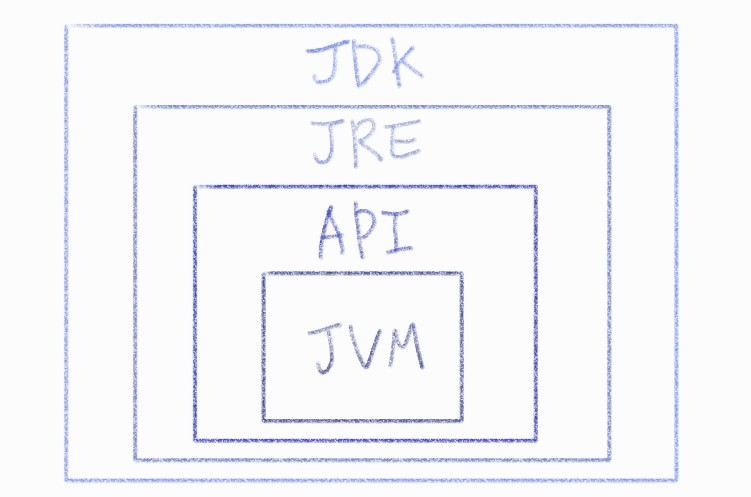

###### 210601_tue

# Intro

> 가장 먼저 자바에대해 알아보자

### What is Programming?

- 프로그래밍이란
  - 소스 -> 컴파일러 -> 기계어
  - 컴파일러 : 인간이 작성한 소스를 기계어로 변환하는 역할
  - 개발자 업무영역 : 소스 생성
  - 컴파일러가 알아서 기계어로 변환해줌

<br>

### Java의 탄생

- 1995년 james Gosling의해 탄생
- Sun Microsystems에서 발표
- Oak(오크)언어에서 시작, Java언어로 발전
- 가전제품에 탑재할 수 잇는 프로그램을 개발하기위한 목적으로 탄생
  - 가전제품간의 네트워킹 등을 구현하기위한 목적
- 2000년대 초반, 인터넷 활성화와 동시에 Java를 기반으로 한 웹 프로그래밍 JSP 유행하면서 본격적으로 사용

<br>

### Java 언어의 특징

- C, C++에서 한단계 더 업그레이드, 특정 목적에 맞게 만들어낸게 Java

##### 초기 Java의 단점

- 기존 C/C++에 비해 **속도 굉장히 느림**
  - C/C++ : 메모리에 직접 접근해서 관리
  - Java : **중간에 다른 매개체**둬서 관리
  - 한 단계 프로세스가 늘어나 속도 느림
- **리소스**(메모리, CPU) **많이 사용**
  - CPU : 연산하는 역할
  - 메모리 : 데이터 이동시키는 역할
  - C/C++에 비해 상대적으로 많이 사용

<br>

###### 여기서 발전된 현재 자바는 여러 장점을 가집니다!!!!

<br>

##### 현재 Java의 장점 :white_flower:

- **객체 지향 언어**로 **부품화**할 수 있다

  - 객체 : 한사람 한사람이 만든 프로그램
  - 객체를 계속 `연결해 확장`하면 큰 하나의 프로그램 만들 수 있다
  - 자전거 부품 하나를 교체해서 성능을 높이는 느낌!

- **JRE**를 이용해서 **운영체제로부터 자유롭다**

  - OS : window, Linux 등등 다양
  - window에서 개발하면 Linux에 가서는 다시 세팅해야함!

    ###### BUT!!!!

  - Java : window에서 개발해서 Linux에서 사용한다면, 해당 OS에 맞는 JRE만 설치하면 OK 

  - 알아서 컴파일, 프로그래밍 해줌

    ###### 즉, OS환경에 상관없이 한번만 코딩하면 된다 :heavy_check_mark:

- 웹 및 모바일 프로그래밍이 쉽다

  - 웹 개발하는데 아주 많은 기능 제공
  - 큰 프로젝트는 보통 Java
  - 안드로이드는 다 Java기반

- **GC**를 통한 **자동 메모리 관리**를 지원한다

  - `Garbage Collection` (GC)

  - C/C++ : 메모리 직접 관리, 다 쓰고 반환하는 작업도 직접 수행

  - Java : 메모리 접근 불가, 필요한 만큼 메모리 사용하고 냅두면 GC가 필요없다고 판단하고 회수

    ###### 즉, 개박자가 메모리 쓰고 반환하거나할 필요 없다 (알아서 정리해줌)

- 실행 **속도**가 많이 **개선**되어 빨라졌다

<br>

### 프로그래밍을 위한 기본 준비물

> 개발자가 개발하기 위해서는 JDK필요, 프로그램만 사용한다면 JRE까지만 설치해도 OK

- **JDK** (Java Development Kit)
  - Java 개발을 위한 키트
  - 실제 Java 프로그래밍 개발
- **JRE** (Java Runtime Environments)
  - Java 프로그래밍이 실행될 수 있는 환경 만들어줌
  - OS에 맞는 JRE존재
- **API**
  - JVM 컨트롤
  - JVM이 일할 수 있는 기능
- **JVM** (Java Virtual Machine)
  - 프로그래밍 실행시 JVM 실행되며 동작



<br>

### 설치 및 기본 실행

- Oracle - **JDK**
  - SE (Standard Edition)
  - OS에 맞는 것 설치 (window 64bit)

- **Eclipse**
  - 편집기
  - IDE (Integrated Development Environment, 통합개발환경)
    - 코드 작성 및 실행, 컴파일, 디버깅(에러확인)을 하나의 툴에서 수행

- 실행
  - java 프로젝트 생성
  
  - src - class 생성
    - main method 추가 (어떤 class가 먼저 실행되어야할지 명시)
    - main 작성 후 ctrl + space : 자동완성
    
    ```java
    public class MailClass {
    	//가장 먼저 실행되야할 파일에 main method 추가
    	public static void main(String[] args) {
    		System.out.println("Java");
    	}
    }
    ```
    
  - 저장
  
  - run (java application)
