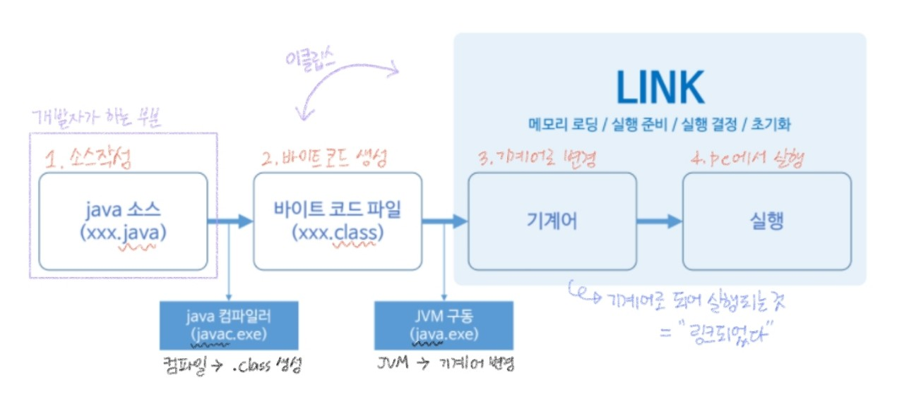
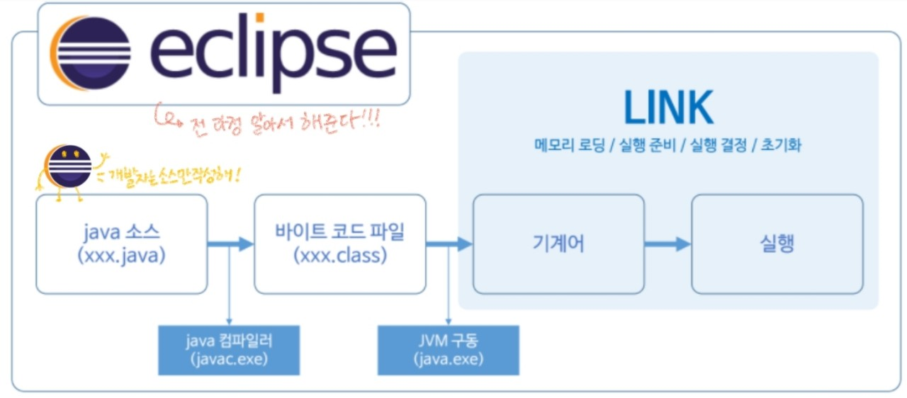
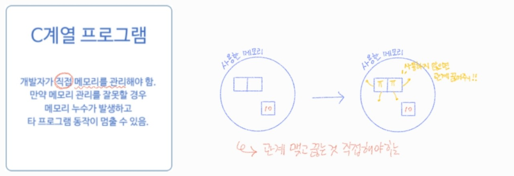
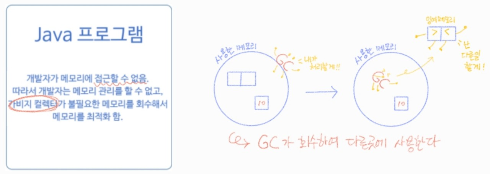

###### 210601_tue

<hr>

###### 오늘의 목차 :lemon:

#### Basic Syntax

- **Java 프로그램의 실행 구조** :heavy_check_mark:
- 변수
- 기본 자료형
- 특수 문자와 서식 문자
- 연산자
- 배열
- 배열과 메모리
- 조건문
- 반복문

###### 기본 문법을 익히고 활용해봅시다!! :tropical_drink:

###### 일단은 실행구조부터!

<hr>
<br>

# 1. Java 프로그램의 실행 구조

> 어떻게 실행되는지?? 실행 구조를 알아봅시다

<br>

## 1.1 환경변수 설정

### What is 환경변수??

- javac.exe, java.exe를 **다른 디렉토리에서도 실행할 수 있도록** 하기위해 **환경변수(Path)에 bin 경로를 등록**한다

### 무엇을 등록할까

- [Program Files] - [Java] - [**jdk**-15.0.1] - [**bin**]
  
  - `javac.exe` : **컴파일러**
    - 소스를 코딩한 뒤, 기계어로 바꾸는 역할 (class 파일 생성)
  - `java.exe` : **JVM 구동 명령**
    - 컴파일을 통해 만들어진 쿨래스파일로 자바 프로그래밍을 실행
  
  ###### 설정하지 않으면 bin 폴더에 존재하는 파일만 구동할 수 있습니다!!! 
  
  ###### 그럼 너무 불편하겠죠?? :anguished:

### 설정방법

1. 내컴퓨터 - 오른쪽마우스 - [속성]

2. [고급 시스템 설정] - [환경 변수]

   - `시스템 변수` : 해당 PC를 사용하는 모두가 사용할 수 있는 변수

   - `사용자 변수` : 해당 사용자에 대해서만 사용 가능한 변수 (해당 PC안에 사용자 계정이 여러개인 경우 해당 사용자만 사용가능)

3. **시스템 변수** - [새로 만들기]

   - 변수이름 : `JAVA_HOME`
   - 변수 값 : `C:\Program Files\Java\jdk-15.0.1` (bin폴더가 있는 위치)
   - 어디 설치되었는지 알려주는 역할!!

4. 시스템 변수 - **Path** 택 - [편집] 

   - [새로만들기]
   - `C:\Program Files\Java\jdk-15.0.1\bin` 추가 (bin폴더 경로)

5. 설정 확인

   - window + r
   - cmd창에서 버전 확인

   ```shell
   C:\User\Username> java -version
   ```

###### 여기까지 하면 이제 어디서든 코딩할 준비 완료!! :sparkles:

<br>

## 1.2 Java 컴파일러와 JVM

> Java 소스 작성 부터 프로그램 실행까지의 순서를 알아보자

#### 전체적인 실행 구조 :cherries:



1. `Java 소스(.java)` 작성
2. `바이트 코드(.class)`로 변환 ( feat. Javac.exe )
3. Link
   - 기계어로 변경 ( feat. java.exe )
   - 실행 (메모리 로딩, 실행 준비, 실행 결정, 실행 초기화)

###### 전체적인 실행 구조는 알아둡시다!!! (C도 비슷하게 동작한다는 사실!)

<br>

#### 개발자의 역할??

- 개발자 : 소스코드 작성
- 이클립 : 나머지 전 영역 (컴파일부터 기계어변경 및 실행까지)

<br>

## 1.3 Java 프로그램 실행

> 이클립스가 모든 기능을 해주긴 하지만... 어떻게 실행되는지는 아는게 좋겠죠???

#### :wink: ​직접 java 프로그램을 실행해보자 :nerd_face:

1. **java 소스 코드 작성**

   - 메모장에 `class` 만들기 

     ```java
     public class JavaWorld{
     	
     	public static void main(String[] args) {
     		System.out.println("Hello Java World");
     	}
     }
     ```

   - `JavaWord.java`로 workspace(이클립스 프로젝트 저장하는 위치)에 저장

2. **컴파일**

   - `cmd` 실행

   - workspace로 이동

     ```shell
     C:\Users\Username>cd C:\Users\Username\workspace
     ```

   - `바이트 코드 생성 (컴파일)`

     - **JavaWorld.class** 파일 생성

     ```shell
     C:\Users\Username\workspace>javac.exe JavaWorld.java
     ```

3. **Link**

   - `JVM에서 실행`

     - 확장자 생략하고 작성

     ```shell
     C:\Users\Username\workspace>java JavaWorld
     ```

   - `결과 출력`

     ```shell
     Hello Java World
     ```

###### 이렇게 직접 코딩할 일은 없지만.. 그래도 어떻게 실행되는지 정도는 알아두자

<br>

## 1.4 이클립스 사용의 장점

> 개발자는 코드만 잘 작성해!!!
>
> 이클립스가 다 해줄게 :wink:

- `컴파일`, `디버깅` 그리고 `실행`까지 **쉽게** 할 수 있다

- 저장만 하면 **알아서 다 해준다**!!!

  

<br>

## 1.5 가비지 컬렉터 (Garbage Collector)

> 프로그램 실행에 필요한 **메모리**를 Garbage Collector가 **자동으로 관리**한다

##### 실제로 프로그램을 수행하려면 :computer: ​`PC상에 있는 메모리`를 사용한다 

#### C계열 프로그램

- 메모리와 관계를 맺고 끊는 걸 개발자가 직접 해줘야한다!



#### Java 프로그램

- 가비지 컬렉터가 회수하여 잉여 메모리로 가져가면, 다른 곳에서 이를 활용한다



<br>

###### 여기까지 기본적인 실행 구조였습니다!!! 

