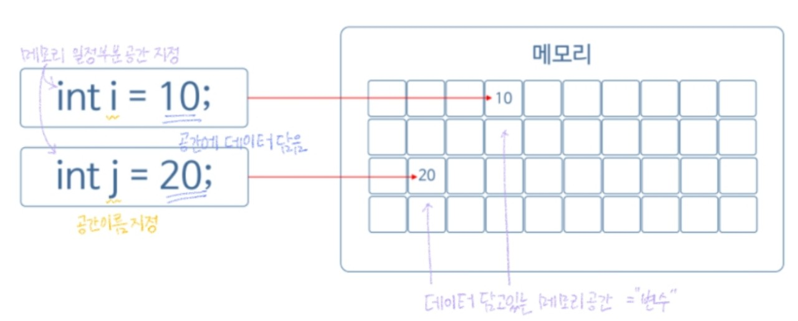
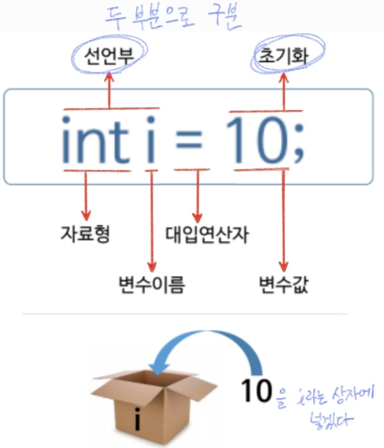
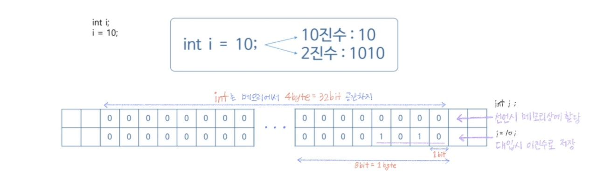

###### 210608_tue

##### 필기만 한거... 정리중!

<hr>


###### 오늘의 목차 :lemon:

#### Basic Syntax

- Java 프로그램의 실행 구조 
- **변수** :heavy_check_mark:
- 기본 자료형
- 특수 문자와 서식 문자
- 연산자
- 배열
- 배열과 메모리
- 조건문
- 반복문

###### 오늘은 변수입니다!! 변수는 기본! :leaves:

<hr>

<br>

# 2. 변수 (Variable)

> 메모리에 데이터를 저장해서 **재활용**하는 방법을 알아봅시다!!

<br>

## 2.1 변수란?

> **데이터(자료)**를 임시로 **담을 수 있는 상자**(메모리 공간)

- 프로그래밍할 때, 많은 데이터를 처리한다
  - 예) 학급의 점수 관리하는 프로그램
    - 각 학생의 점수를 저장해둠
    - 어떤 연산이 필요할 때, 저장해둔 점수를 사용함

- 각 **데이터**를 **저장해 놓은 곳** = `변수`
- `int i = 10`
  - 메모리 일정 부분의 공간 지정, 이름 i로 설정
  - 그 공간에 10이라는 데이터 담음
  - 변수 = 데이터 담긴 상자



- `자료형` (다음 시간에 할 내용!)
  - 상자안에 담긴 **데이터 형태**
  - 정수, 실수, 문자, 문자열... 어떤 것이 담겼는지 명시해줘야함!

<br>

##### What is variable??

##### :arrow_forward: 데이터 담고 있는 메모리의 일정한 공간!!

<br>

## 2.2 변수 선언과 초기화

> 변수를 사용할 때는 **초기화**를 해줘야합니다!!!



- **선언부**
  - `int` (자료형) : 어떤 데이터 담길지
  - `i` : 상자 이름
  - **변수 선언했다** = 메모리 상에서 값은 정해지지 않았지만 **특정 공간까지 만들어둔 것**
- **초기화**
  - `=` : 대입연산자 (할당연산자)
    - 오른쪽의 값을 **왼쪽에 대입**하겠다
    - 10을 i라는 상자에 넣겠다!
  - **변수의 초기화** = 공간에 10 (데이터) 을 넣음
- `;`(세미콜론)
  - 한 문장의 완결 (문장 끝에 꼭 써저야함)

##### `선언부`까지만 하면 공간 확보, 대입연산자를 이용해 원하는 값을 대입 (`초기화`)할 수 있다

<br>

#### 선언과 초기화 순서

- **변수 선언 후 초기화**

  ```java
  int i;
  i = 10;
  System.out.println("i = " + i);  //i = 10
  ```

- **변수 선언과 초기화 동시 진행**

  ```java
  int j = 20;
  System.out.println("j = " + j);  //j = 20
  ```

<br>

#### 사용해보자

- i + j를 출력하자

  ```java
  package basicSyntax;
  
  public class MainClass {
  	public static void main(String[] args) {
  		int i = 10;
  		int j;
  		j = 100;
  		System.out.println("i + j = " + (i + j));  //i + j = 110
  	}
  }
  ```

- 변수는 **재할당이 가능**하다

  ```java
  package basicSyntax;
  
  public class MainClass {
  	public static void main(String[] args) {
  		int i = 10;
  		int j;
  		j = 100;
          i = 200;
  		System.out.println("i + j = " + (i + j));  //i + j = 300
  	}
  }
  ```

##### `ctrl + F11`을 누르면 자동 실행됩니다!

<br>

## 2.3 메모리 할당과 진법

> 변수를 저장하면, **2진수 형태**로 메모리에 저장된다는 사실!!

#### 자료형의 선언

- 변수 선언 시 **자료형 선언** 필요
  - 숫자 : 정수, 실수형
  - 문자 : a, b
  - 문자열 : abcd
  - Boolean : true/false
- 자료형에 따라서 변수가 전체 메모리에서 **차지하는 공간이 달라짐**

<br>

#### `int`를 기준으로 보자



- `4byte` = 8bit * 4 = `32bit `

- **int i;** 로 **선언**
  
  - 32bit가 `메모리 상에 할당`만 됨 (32칸)
  
- **i = 10;**으로 **대입(할당)**
  
  - `2진수`로 진법변환되어 `저장`됨 (10 => 1010)
  
  ###### PC 계산기에서 [프로그래머] - [비트 전환 키패드]를 사용하면 binary 확인이 쉽습니다!! :honey_pot:

<br>

## 2.4 변수 데이터 변경

> 변수의 데이터는 **언제나**:point_left: 변경 가능합니다!!!

#### 데이터 변경하기

```java
int num = 0;  //num 변수 선언 및 초기화
System.out.println("num = " + num);  //num = 0

num = 10;  //데이터 변경
System.out.println("num = " + num);  //num = 10

num = 200;
System.out.println("num = " + num);  //num = 200

num = 0;
System.out.println("num = " + num);  //num = 0
```

<br>

### Why use variables?

##### :point_right: `재활용`하기 위해서!!

- 예) **A, B, C라는 학생의 점수를 관리**한다고 하자

  - 점수를 각각 A, B, C라는 변수에 담아 저장해둔다
  - 총합을 구한다면? A + B + C
  - 가장 큰 수, 가장 작은 수를 구한다면? A, B, C를 활용해 비교한다!

  ###### 이런식으로 변수에 데이터를 담아두면 필요할 때마다 재활용할 수 있습니다!

- 예) 기상시간을 알려주는 프로그램을 만들자

  - 기상시간을 H = 5; 로 저장해둔다
  - 5시라는 시간을 사용할 때마다 H를 사용하면 된다!!!!

<br>

##### 즉, 상징적인 의미로 값을 담아놓고, 필요할 때 재활용 할 수 있다!!!!

###### 변수는 프로그래밍에서 항상 쓰이는 요소! 기초내용은 알고 사용합시다

