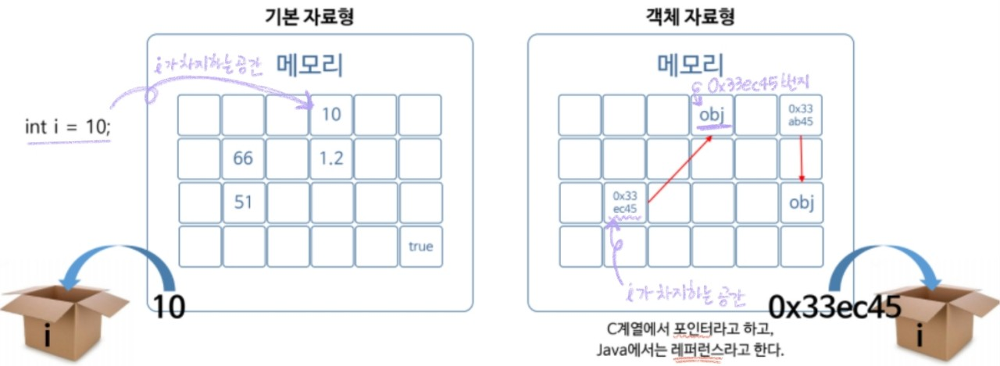
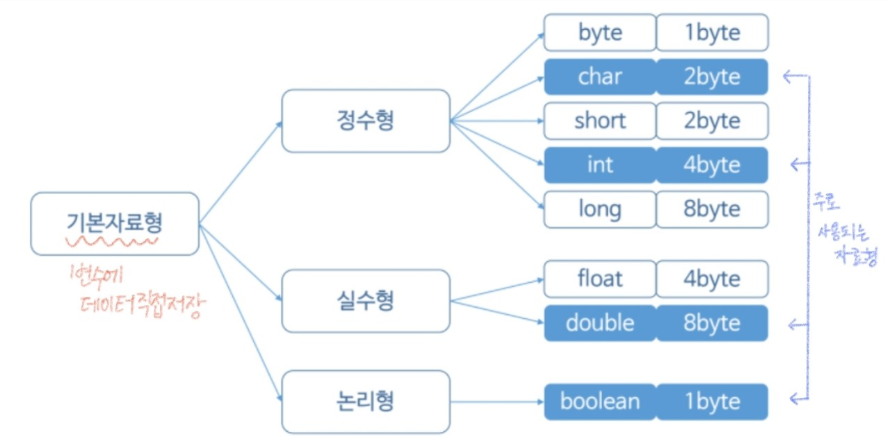

###### 210609_wed

<hr>


###### 오늘의 목차 :lemon:

#### Basic Syntax

- Java 프로그램의 실행 구조 
- 변수 
- 기본 자료형 :heavy_check_mark:
- 특수 문자와 서식 문자
- 연산자
- 배열
- 배열과 메모리
- 조건문
- 반복문

###### 자료형을 알아야 변수를 사용할 수 있다 :lollipop:

<hr>

<br>

# 3. 자료형(Data Type)

> 데이터 종류마다 크기가 다르다는 사실!
>
> 데이터가 메모리에서 차지하는 크기에 대해 학습합시다!!

<br>

## 3.1 기본자료형과 객체자료형 :star:

> 자료형은 2가지로 구분됩니다

#### 기본 자료형 (Primitive Data Type)

- 변수에 **데이터 직접 저장**
  - 전체 메모리의 일정 공간을 변수가 차지하고, 그곳에 데이터가 직접 저장된다
- `int i = 10;`
  - 메모리에 **i라는 일정 공간** 만들고, 그곳에 **데이터 10이 들어감**
- **종류**
  - 정수, 실수, 문자, 문자열, Boolean(참 거짓)
  - 데이터에따라 변수의 `크기변화`

##### :point_right: 즉, 선언한 변수에 공간 할당되고, 초기화를 거쳐 데이터가 바로 들어간다

<br>



<br>

#### 객체 자료형 (Reference Data Type)

- 변수에 **객체 메모리 주소** 저장 (**참조한다**, reference)
  - 객체가 메모리에 담겨있고, 변수는 그 객체를 가르킨다

- `객체 자료형 i를 만든다`
  - 내가 만든 객체가 i에 바로 들어가는 것 X
  - 객체가 메모리 어딘가에 존재하고, **i는 다른 메모리값**을 잡아 **객체의 주소를 저장**한다
- 레퍼런스의 크기는 항상 `4byte` (항상 주소만 들어감)

##### :point_right: 즉, 객체를 담아놓고 다른곳에 변수를 만든 뒤 객체가 있는 메모리의 주소를 변수에 담는다

<br>

## 3.2 Java 기본자료형



#### 정수형

- **byte** (바이트)
  - 1 byte = 8bit
  - -128 ~ +127 (256개의 정수 표현 가능)
  - 잘 사용 X
    - 표현할 수 있는 숫자가 너무 적음
    - 128부터는 누실됨 (overflow 발생)
  
- **char** (문자) :cherries:
  
  > 아스키 코드로 변환되어 0, 1만으로 컴퓨터에서 표현되기 때문에 정수형으로 분류했습니다!
  
  - 2 byte = 16bit
  - 단일문자 하나 ('A', 'b'...)
  
- **short**

  - 2 byte = 16bit
  - byte보다는 크지만, 큰 숫자 표현 X 하기 때문에 잘 사용되지 않음

- **int** :cherries: :cherries:

  - 4 byte = 32bit
  - 실생활에 필요한 모든 숫자 표현 가능 (많이 쓰임)

- **long**

  - 8 byte = 64bit
  - 실생활에 쓰지 않는 큰 수까지 표현

<br>

#### 실수형

> 3.14, 1.78 이런식으로실수형으로 표현되는 것

- **float**
  - 4 byte = 32bit
- **double** :cherries:
  - 8 byte = 64bit
  - 프로그래밍하면서 필요한 모든 소수 표현 가능 (더 많이 씀)

<br>

#### 논리형

- **boolean** :cherries:

  - 1 byte = 8bit

  - true / false

    > 참고!
    >
    > C 계열은 0 = false / 0이 아닌수 = true
    >
    > C++, Java : true, false 존재

<br>

#### 문자열??

> **객체 자료형**입니다!!!!

- 4 byte

- **String** 자료형 사용

  - String인 ABCD 저장
  - str은 따로 만들어 ABCD가 가진 객체의 주소를 저장함

  ```java
  String str = "ABCD"
  ```

<br>

<br>

### 직접 사용해보자

- Java 프로젝트 생성
- class 생성
  - 시작 첫 단어는 대문자
  - main 적어주기

- 자료형 사용하기

  - 메모리 할당되고 데이터 저장된다
  - 변수 사용해 값 출력

  ```java
  package dataFormat;
  
  public class MainClass {
  	public static void main(String[] args) {
  		char c = 'a';
  		System.out.println("c = " + c);  //c = a
  		
  		int i  = 10;
  		System.out.println("i = " + i);  //i = 10
  		
  		double d = 10.123;
  		System.out.println("d = "+ d);  //d = 10.123
  		
  		boolean b = false;
  		System.out.println("b = " + b);  //b = false
  		
  		String s = "Hello Java World";
  		System.out.println("s = " + s);  //s = Hello Java World
  		//원래 객체 생성할때는 new로 객체를 선언해주고 시작해야하는데
  		//워낙 많이 쓰여서 선언해주고 대입연산자로 값을 넣을 수 있도록 만들어줌
  		//String str = new String();
  		
  	}
  }
  ```

<br>

<br>

## 3.3 형 변환 (Type Casting)

> 자료형간의 변환이 가능합니다!

#### 묵시적 (Implicit) 형변환 (자동적 형변환)

- **작은** 공간의 메모리에서 **큰** 공간의 메모리로 이동

- 예) byte (1 byte) => int (4 byte)

  ```java
  byte by = 10;
  int in = by;
  System.out.println("in = " + in);  // in = 10
  ```

  - 작은 데이터가 큰 공간으로 옮겨가는 것이기때문에 아무 **문제없이 값이 들어간다**

<br>

#### 명시적(Explicit) 형변환

- **큰** 공간의 메모리에서 **작은** 공간의 메모리로 이동

- 예) int (4 byte) => byte (1byte)

  - ()를 사용해 변경할 형을 표현해야한다
  - 큰 값을 작은 값으로 변경하기 때문에 누실 (overflow)이 발생할 수 있다

  ##### 정상적으로 들어가는 경우

  ```java
  int iVar = 100;
  byte bVar = (byte)iVar;
  System.out.println("bVar = " + bVar);  // bVar = 100
  ```

  ##### overflow (누실) 되는 경우

  - 값이 너무 커서 1 byte 공간에 모두 들어가지 않음 (들어갈 수 있는 만큼만 들어가고 전부 날아감)

  ```java
  iVar = 123456;
  bVar = (byte)iVar;
  System.out.println("bVar = " + bVar);  // bVar = 64 (1 byte 부분만 남은거)
  ```

##### 데이터가 누실될 가능성이 있으므로 `처음부터 큰 데이터`를 사용하자!

