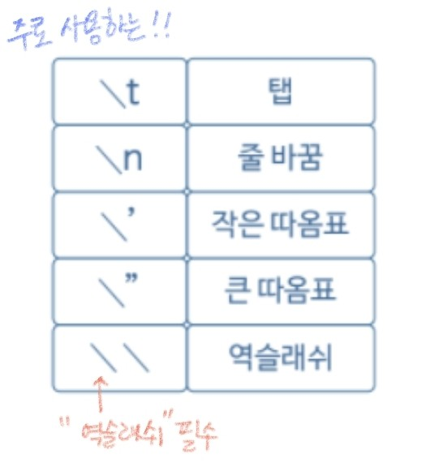
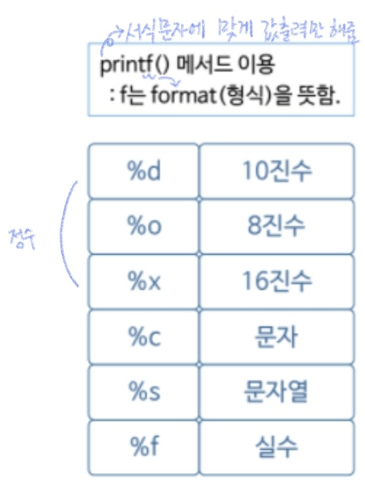

###### 210609_wed

<hr>


###### 오늘의 목차 :lemon:

#### Basic Syntax

- Java 프로그램의 실행 구조 
- 변수 
- 기본 자료형 
- **특수 문자와 서식 문자** :heavy_check_mark:
- 연산자
- 배열
- 배열과 메모리
- 조건문
- 반복문

###### 특수문자는 뭐고 서식문자는 뭐니 맨날 막 불러서 낯설다... :dizzy_face:

<hr>
<br>

# 4. 특수 문자와 서식 문자

> 일반적으로 사용하는 문자가 아닌! 
>
> 특수한 경우 또는 특정한 서식에 맞게 사용하는 문자에대해 알아보겠습니다

## 4.1 특수 문자

- 일반 문자가 아닌 **특수한 목적**으로 사용되는 문자

- 역슬래쉬와 함께 사용되어야합니다

  

#### 사용하기

```java
System.out.println("Good Morning");  //Good Morning
System.out.println("Good\tMorning");  //Good	Morning
System.out.println("Good\nMorning");  //Good
									  //Morning
System.out.println("Good\'Morning\"");  //Good'Morning"
System.out.println("Good\\Morning\\");  //Good\Morning\
```

###### 많이 사용되지는 않는다!

<br>

#### 주석

- 컴파일러가 **컴파일하지 않는** 부분 (저장과 동시에 컴파일 진행)
- 디버깅용, comment용(어떤 코드인지 설명)으로 사용

- 종류
  - `//` : 한 줄
  - `/**/` : 여러줄

<br>

## 4.2 서식 문자

- 일반 문자가 아닌 **서식**에 사용되는 문자

  

#### 사용하기

- `println` : 한 문장이 출력되고 개행되는 메서드

- `printf` : 서식문자에 맞게 값을 출력만해주고, 개행하지 않는 메서드

  (강제로 개행해서 다음 문자열이 에쁘게 출력되도록 함)

```java
//오늘의 강수량 70%!
System.out.println("오늘의 강수량 70%!");
System.out.printf("오늘의 강수량 %d%%!", 70);
```

```java
System.out.printf("안녕 %c반 %s\n", 'A', "Mina");  //안녕 A반 Mina
```

<br>

#### Why use??

- 데이터를 **실시간으로 변경**해서 사용할 수 있다 (동일 문장에서 해당 부분만 변경해서 사용 가능)
- 예) 서버의 네트워크에서 들어오는 값을 변수에 저장한 뒤 출력한다

###### 주로 사용하는 서식문자 표현한 것! 이정도만 알자

<br>

## 4.3 서식 문자의 정렬과 소수점 제한 기능

#### 문자정렬

- **왼쪽 정렬** : 일반적

  ```java
  System.out.printf("%d\n", 12);   //12
  System.out.printf("%d\n", 123);  //123
  ```

- **오른쪽 정렬** : %[생성할 자릿수]\[서식문자]

  ```java
  // 세칸 공간 만들고 오른쪽 정렬
  System.out.printf("%3d\n", 12);   // 12
  System.out.printf("%3d\n", 123);  //123
  ```

#### 소수점 제한

- 몇 자리 소수점 까지 나타낼 것인지

- %.[나타낼 소수점 자릿수]\[서식문자]

  ```java
  //0으로 소수점 표현됨
  System.out.printf("%f\n", 1.23);  //1.230000
  //소수점 나타내지 않음
  System.out.printf("%.0f\n", 1.23);  //1
  //소수점 한자리까지 나타냄
  System.out.printf("%.1f\n", 1.23);  //1.2
  ```

###### 빈번히 쓰이지는 않지만 가끔 쓰이긴 함!! 알아는 두자

