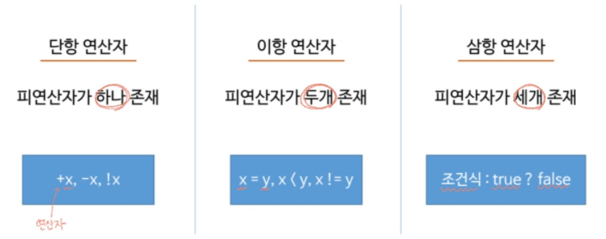
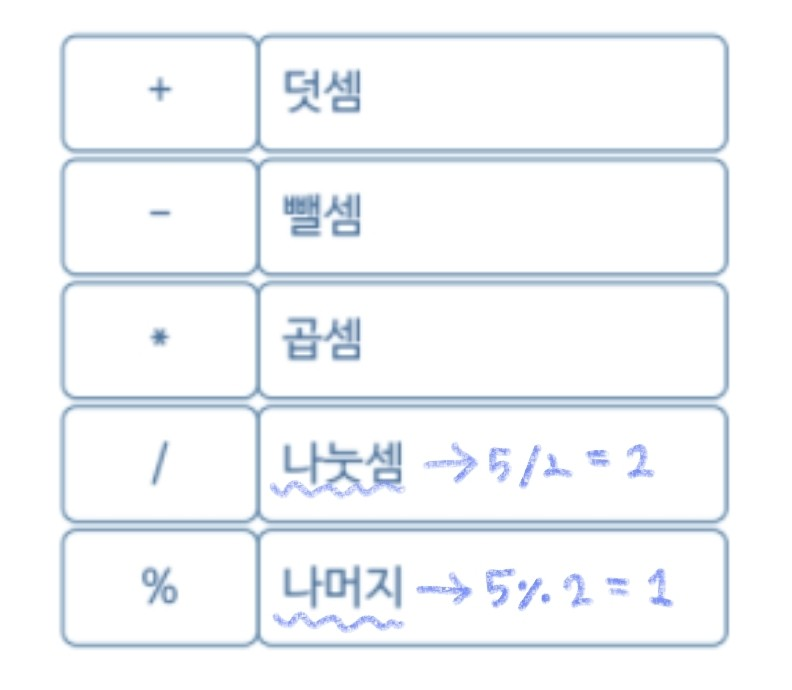
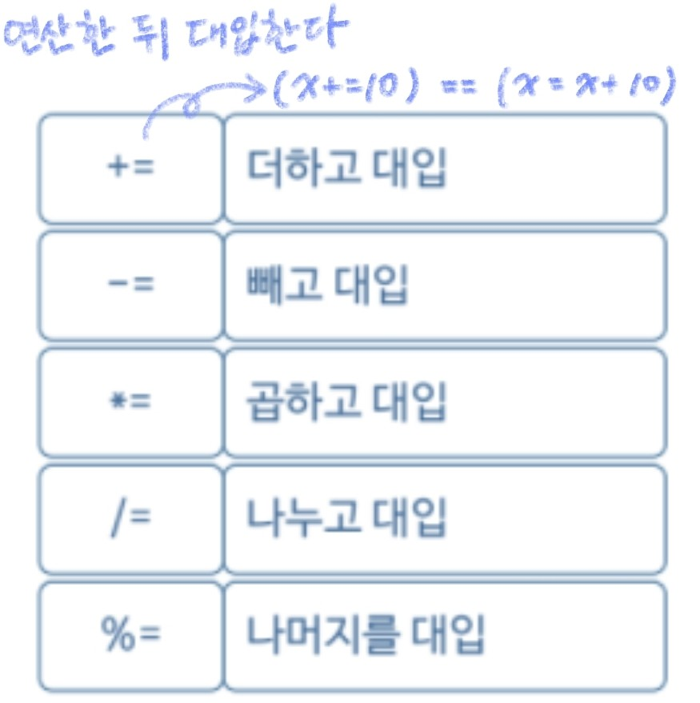

###### 210609_wed

##### 필기만 한거... 정리중!

<hr>


###### 오늘의 목차 :lemon:

#### Basic Syntax

- Java 프로그램의 실행 구조 
- 변수 
- 기본 자료형 
- 특수 문자와 서식 문자 
- **연산자** :heavy_check_mark:
- 배열
- 배열과 메모리
- 조건문
- 반복문

###### 연산자는 역시 기본!

<hr>


<br>

# 5. 연산자 (Operator)

> 프로그램이 실행될 때 컴퓨터 (CPU)한테 계산(연산) 업무를 시키는 방법을 알아보자
>
> 컴퓨터: 하드 / 메모리 (하드에 있는 데이터 CPU에 전달) / CPU (연산)

<br>

## 5.1 피연산자 개수에 의한 연산자 구분

> 피연산자의 개수에 따라 3가지로 구분된다!
>
> 교과서적인 얘기... 실제 프로그래밍할 때 구분할 필요는 없다



<br>

## 5.2 대입 연산자

> **오른쪽**의 결과를 **왼쪽에 대입 (할당)** 한다

- `=`
  - 수학 : 오른쪽과 왼쪽 값이 같다
  - **프로그램** : 오른쪽 값을 왼쪽에 대입

- `x = y`

  - x에 y 값을 할당

  ```java
  int x = 10;
  int y = 20;
  
  System.out.println("x = " + x);  //x = 10
  x = y;
  System.out.println("x = " + x);  // x = 20
  ```

<br>

## 5.3 산술 연산자

> 피연산자를 이용해 덧셈, 뺄셈, 곱셈, 나눗셈, 나머지 연산 수행



#### 사용해보기

```java
int x = 5;
int y = 2;

System.out.println("x + y = " + (x + y));  // x = 7
System.out.println("x - y = " + (x - y));  // x = 3
System.out.println("x * y = " + (x * y));  // x = 10
System.out.println("x / y = " + (x / y));  // x = 2
System.out.println("x % y = " + (x % y));  // x = 1
```

- 나눗셈
  - `(int) / (int) = (int)` 
  - 소수점까지 구하려면? **형변환** `(double) x / y`

<br>

## 5.4 복합 대입연산자

> **산술** 연산자와 **대입** 연산자를 **결합한** 연산자



#### 사용해보기

```java
```


## 5.5 관계 연산자

- 두 피연산자 비교, 참 거짓 결론 도출
- `>`
- `<`
- `>=`
- `<=`
- `==`
- `!=`

## 5.6 증감 연산자

> 앞뒤에 붙는지에 따라 먼저 연산을 하고 출력하는지, 출력하고 연산하는지

- `++` : 1만큼 증가
  - ++x : x = x + 1;
    - 전위연산자 : 일단 더하한값을 메모리에 저장한 뒤 출력
  - x++
    - 후위연산자 : 일단 출력, 후에 메모리에 더한 값을 저장
- `--` : 1만큼 감소

## 5.7 논리 연산자

- `&&` : 모두 참이면 참
- `||` : 하나만 참이면 참
- `!`

## 5.8 조건(삼항) 연산자

- 조건식? 식1: 식2
  - 조건식이 참이면 식1, 거짓이면 식2 실행

자주 쓰이고 유용하자!!!

## 5.8 비트 연산자

> 메모리 관리할 일 없어서 많이 끄이진 않음
>
> 다른 연산자보다 빠르다!! 다른 연산자처럼 이진수로 변환하는 과정이 없기때문에!

- `&` : 모두 1이면 1
- `|` : 하나 1이면 1
- `^` : 다르면 1

