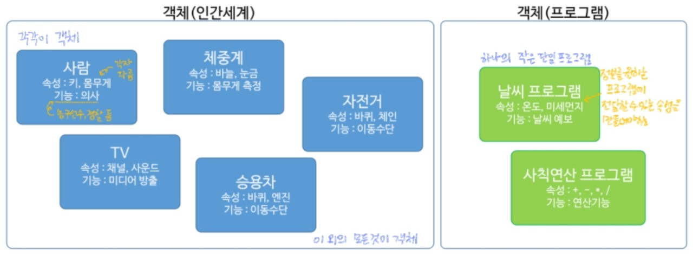

###### 210615_tue

##### 필기만 한거... 정리중!

###### 오늘의 목차 :dolphin:

#### Java 객체(Object)

1. **객체 지향 프로그래밍이란** :heavy_check_mark:
2. 클래스 제작과 객체 생성
3. 메서드
4. 객체와 메모리
5. 생성자와 소멸자 그리고 this 키워드
6. 패키지와 static
7. 데이터 은닉

###### 객체 지향 프로그래밍!! 중요@@

 

# 1. 객체 지향 프로그래밍이란

> 객체 지향 프로그래밍 `Object-Oriented Programing(OOP)`에 대해 알아봅시다!!

- **객체 지향 프로그래밍**
  - 자바의 큰 특징
  - 하나의 프로그래밍 기법
  - 다른 언어도 많이 채택해서 진행함

###### 오늘은 무엇인지 알아보고, 다음 시간부터 구현을 해보자

## 1.1 객체(Object)란?

> 세상에 **존재하는 모든 것** (눈에 보이는 모든 것)
>
> 프로그래밍에서 **속성과 기능을 가지는 프로그램 단위**

### 객체 (Object)

- **특정 목적**을 위해 만들어진 것
- 구성
  - 그 목적을 수행하는 **기능**
  - 기능을 위해 필요한 **속성**

 

###### 쉽게 생각해보자

#### 객체 예시

- PC : 메모리, CPU, 하드디스크 등 으로 구성

  - PC도 객체, PC를 이루는 각각도 객체

- 사람

  - 기능 : 의사 / 농구선수 / 경찰 등 개인의 능력
  - 속성 : 키, 몸무게 등

- 체중계

  - 기능 : 몸무게 측정
  - 속성 : 바늘, 눈금 등

  ###### 자전거, TV 등 모든 것이 객체!!

 

###### 프로그래밍에서도 동일하게 객체를 도입했다

#### 프로그래밍에서의 객체 예시

- 기상센터의 프로젝트 진행

- **날씨 프로그램** 담당

  - 기능 : 날씨 예보
  - 속성 : 온도 미세먼지 등

- 내가 만든 프로그램에서 다른 프로그램이 **원하는 부분을 전달할 수 있는 속성**을 만들어야함 

  온도를 원하면 이를 보여줄 수 있는 속성 필요

  ###### 이것도 하나의 객체, 큰 프로그램안의 작은 단일 프로그램이라 할 수 있음

##### 이런 모든 것이 객체이며, 객체는 기능과 속성을 가진다!

##### 따라서... 객체란?

- 눈에 보이는 것 그대로
- 프로그램은 보이진 않지만, 하나의 기능들을 가져다 객체라고 함!

 

###### 객체지향에서 많이 언급되는 단위, class를 알아보자

## 1.2 클래스(class)란?

> **객체를 생성하기 위한 틀**
>
> 모든 객체는 클래스로부터 생성

### class 예시

- 객체를 생성하기 위한 틀!!!
- 붕어빵 기계와 같은 역할!
- 사람이라는 객체를 만들어야함
  - 필요에따라 의사, 농구선수 등등을 만ㄷ릉어ㅑ함
- 차
  - 중형, 소형, suv
- 이렇게 어떤 용도인지에 따라 객체가 좀 달라짐
- 이때 다양한 객체를 만들기위한 **틀을 만들어 놓는 것이 class**
- 예) 붕어빵 기계
  - 기계는 그대로
  - 손님이 요구하는 것에따라 재료를 바꿔 만듦
  - 틀은 그대로 + 안에 들어가는 기능, 속성이 변화
- 그랜저 틀
  - 기능 : 배기량
  - 속성 : 색상 바퀴
- 소비자가옴
  - 기존 틀에서 생상, 배기량을 맞춰서 출시해줌
- 틀은 그대로, 원하는곳에서 상품을 복제해서 사용하면 되는 것!!

프로그래밍

- 날씨 프로그래밍을 만든다
- 어디서는 초미세먼지를 원하고, 어디서는 화씨를 원하고...
- 이런식으로 틀을만들어놓고 원하는 것에따라 커스텀해서 사용함

따라서

- 객체를 만들기위해서는 틀인 클래스가 반드시 필요함!!
- 개발자는 클래스만 만들고, 필요에 따라 클래스에서 객체만 뽑아내면 됨!!!

- 가비지 컬렉터
  - 클래스로부터 필요에 따라 객체를 만들어서 사용함
  - 더이상 필요하지 않으면 레퍼런스하지않고 둠
  - 그러면 메모리에서 날려버림
  - 임자없는 객체를 회수하는 역할을 하는 것이 GC (쓰고있는 것은 건드리지 않음)
  - 누구와도 연결되지 않는 객체 회수

## 1.3 클래스 구성 요소

- 속성 : **멤버변수**
- 기능 : **메서드**

- 자전거
  - 속성 : 안장, 핸들, 바구니 ...
    - 어떤 핸들, 바구니를 사용할건지 결정해서 원하는 객체를 만들어야함
  - 기능 : 기어변속, 가속, 브레이크
    - 가속은 얼마나할건지, 브레이크는 얼마나 잘들게 할건지 등등을 기능으로 만들 수 있음

객체 지향 프로그래밍

- 채택한 이유??
  - 객체를 만들면 부품하나하나를 모듈화 할 수 있다!
  - 예) 자전거를 하나 만듦
    - 안장이 너무 안좋아서 좋은 것으로 바꾸고 싶다고 함
    - 이미 만들어진 것을 가져와서 사용하면 됨(직접 만들 필요 없음)
  - 즉, 프로그램을 내가 다 만들필요가 없음
  - 만들어진 좋은 프로그램을 조합해서 나만의 프로그램을 만들 수 있음
  - 예) 금융 프로그램
    - 기존의 것에서 좋은 기능, 속성을 가져옴
    - 거기서 내가 필요한 것을 더해주면 됨
  - 자전거의 예시에서 안장 같은것도 객체라고 할 수 있음
  - 객체 지향 프로그래밍을 하면 언어의 확장성이 좋다!!